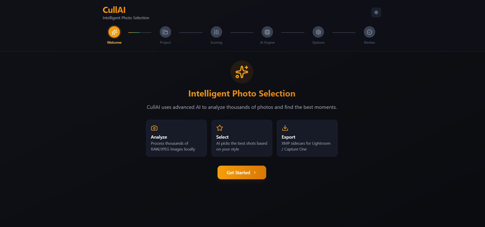

<div align="center">

# CullAI

### _AI-powered photo culling for photographers who value their time_

[](https://github.com/your-org/cullai/releases)
[](https://electronjs.org)
[](https://react.dev)
[](https://github.com/your-org/cullai)

**From memory card to keepers — automatically.**


[Download](#installation) · [Quick Start](#quick-start) · [Features](#features) · [Docs](#usage)

</div>

---

## What is CullAI?

CullAI is a cross-platform desktop application that uses AI vision to intelligently select the best photos from any folder — so you don't have to.

Photographers call the process of manually sorting and selecting shots **culling**. It's tedious, time-consuming, and repetitive. CullAI automates it using the AI model of your choice, scoring every image across six dimensions and explaining _exactly why_ each photo was picked or passed.

> **Your photos never leave your machine.** CullAI processes images locally and only sends resized previews to the AI API you configure. Face detection and RAW decoding run 100% on-device.

---

## Preview



## Features

### Core Capabilities

- 📁 **Full RAW format support** — CR3, NEF, ARW, RAF, DNG, ORF, RW2, PEF, 3FR and more via `lightdrift-libraw`
- 📱 **HEIC support** — iPhone and iPad photos work natively
- 🤖 **Multi-provider AI** — use Claude, ChatGPT, Gemini, or Ollama (local/offline)
- 👁️ **On-device face & eye detection** — blink detection, expression scoring, face sharpness — no face data sent to any API
- 🔁 **Duplicate & burst detection** — perceptual hashing groups near-identical shots before scoring
- ⚖️ **6-dimension scoring** with user-adjustable weights per genre
- 🏷️ **Genre presets** — Wedding, Portrait, Sports, Landscape, Street, Event
- 💾 **Style profiles** — save and reuse your scoring configuration across sessions
- 📤 **XMP sidecar export** — star ratings and color labels visible in Lightroom Classic and Capture One
- ⚡ **Parallel API batching** — configurable concurrent calls for fast throughput
- 🔄 **Session resume** — crash or cancel mid-job? Pick up exactly where you left off
- 💸 **Dry-run mode** — estimate token cost before committing to a full run
- 🔐 **Secure key storage** — API keys encrypted via OS keychain (`safeStorage`)

### Results & Review

- **Tiered gallery view** — S / A / B / Rejected tabs with per-image score breakdown
- **Per-image AI reasoning** — see exactly why the AI rated each shot
- **Keyboard shortcut culling** — `P` pick, `X` reject, `↑↓` navigate, `R` rescue
- **Side-by-side compare mode** — compare 2–4 images directly
- **Face highlight overlay** — visualize which faces were detected and scored
- **Export `results.json`** — full scores and reasoning for every image

---

## Supported AI Providers

CullAI uses the OpenAI-compatible API standard as well as Claude native API. Bring your own key.

| Provider               | Model Examples                       | Notes                                       |
| ---------------------- | ------------------------------------ | ------------------------------------------- |
| **Claude (Anthropic)** | `claude-sonnet-4`, `claude-opus-4`   | Recommended — best reasoning quality        |
| **ChatGPT (OpenAI)**   | `gpt-5`                              | Strong general-purpose vision               |
| **Gemini (Google)**    | `gemini-3.0-flash`, `gemini-3.0-pro` | Fast and cost-effective                     |
| **Ollama**             | `qwen3`, `deepseek`                  | 100% local & offline — no key required      |
| **Custom**             | Any model                            | Any OpenAI-compatible endpoint via base URL |

> 💡 **Ollama mode is always free.** No API key, no internet connection required.

---

## AI Scoring Model

Every image is scored across **6 weighted dimensions**:

| Dimension       | Default Weight | What the AI Evaluates                                  |
| --------------- | -------------- | ------------------------------------------------------ |
| **Quality**     | 25%            | Technical quality, noise, compression artifacts        |
| **Aesthetic**   | 20%            | Visual appeal, mood, artistic merit                    |
| **Composition** | 15%            | Rule of thirds, framing, balance                       |
| **Sharpness**   | 15%            | Focus accuracy, motion blur                            |
| **Exposure**    | 10%            | Brightness, highlight/shadow balance                   |
| **Face & Eyes** | 15%            | Face sharpness, eyes open, blink detection, expression |

Weights are fully adjustable via sliders in the Setup screen and auto-normalize to 100%. Genre presets pre-configure them for your shoot type.

### Genre Presets

| Preset              | Quality | Aesthetic | Composition | Sharpness | Exposure | Face & Eyes |
| ------------------- | ------- | --------- | ----------- | --------- | -------- | ----------- |
| **General**         | 25%     | 20%       | 15%         | 15%       | 10%      | 15%         |
| **Wedding**         | 20%     | 20%       | 10%         | 15%       | 10%      | 25%         |
| **Portrait**        | 20%     | 15%       | 10%         | 15%       | 10%      | 30%         |
| **Sports / Action** | 25%     | 15%       | 10%         | 30%       | 10%      | 10%         |
| **Landscape**       | 25%     | 25%       | 20%         | 15%       | 15%      | 0%          |
| **Street**          | 20%     | 25%       | 20%         | 15%       | 10%      | 10%         |
| **Event**           | 20%     | 15%       | 10%         | 20%       | 10%      | 25%         |

### Output Tiers

| Tier         | Meaning                       |
| ------------ | ----------------------------- |
| **S**        | Top 10% — absolute best shots |
| **A**        | Strong selections             |
| **B**        | Decent, but not selected      |
| **Rejected** | Poor quality or duplicates    |

---

## Supported Image Formats

| Format                     | Camera Brand            | Processing        |
| -------------------------- | ----------------------- | ----------------- |
| JPEG / JPG                 | All                     | Native (Sharp)    |
| PNG, WebP, AVIF, TIFF, GIF | General                 | Native (Sharp)    |
| HEIC                       | iPhone / iPad           | Sharp + libvips   |
| **CR2 / CR3**              | **Canon**               | lightdrift-libraw |
| **NEF / NRW**              | **Nikon**               | lightdrift-libraw |
| **ARW / SR2**              | **Sony**                | lightdrift-libraw |
| **RAF**                    | **Fujifilm**            | lightdrift-libraw |
| **DNG**                    | **Adobe / Leica / DJI** | lightdrift-libraw |
| **ORF**                    | **Olympus**             | lightdrift-libraw |
| **RW2**                    | **Panasonic**           | lightdrift-libraw |
| **PEF**                    | **Pentax**              | lightdrift-libraw |
| **3FR**                    | **Hasselblad**          | lightdrift-libraw |

---

## Installation

### Download Pre-built Installers

The easiest way to get CullAI is to download the latest release for your platform.

| Platform | Installer | Portable |
|----------|-----------|----------|
| **Windows** | [`CullAI-Setup.exe`](https://github.com/AshminDhungana/CullAI/releases/latest) | [`CullAI-Portable.exe`](https://github.com/AshminDhungana/CullAI/releases/latest) |
| **macOS** | [`CullAI.dmg`](https://github.com/AshminDhungana/CullAI/releases/latest) | [`CullAI-mac.zip`](https://github.com/AshminDhungana/CullAI/releases/latest) |
| **Linux** | [`CullAI.AppImage`](https://github.com/AshminDhungana/CullAI/releases/latest) | — |

> 💡 **Windows users without admin rights?** Use the **Portable** build — it runs without installation.
> 💡 **macOS users:** The `.dmg` is signed and notarized. If Gatekeeper shows a warning, right-click → Open.

📦 [**View all releases →**](https://github.com/AshminDhungana/CullAI/releases)

---

### Build from Source

CullAI supports **Windows**, **macOS**, and **Linux** builds using Electron and electron-builder.

### Prerequisites

- Install **Node.js 18+**
- Install **Git**
- Platform-specific build tools:
  - **Windows:** Visual Studio Build Tools
  - **macOS:** Xcode Command Line Tools
  - **Linux:** build-essential, gcc, g++, make

```bash
# Clone the repository
git clone https://github.com/AshminDhungana/cullai.git
cd cullai

# Install dependencies
npm install

# Start in development mode
npm run dev
```

### Build the Application

Build for the current operating system:

```bash
npm run build
```

Or build specific targets:

```bash
# Windows
npx electron-builder --win

# macOS
npx electron-builder --mac

# Linux
npx electron-builder --linux
```

### Build Output

Generated installers will be available in the `dist/` directory:

- **Windows:** `.exe`
- **macOS:** `.dmg`
- **Linux:** `.AppImage`, `.deb`, or other configured formats

> **Note:** `lightdrift-libraw` requires native compilation. Ensure you have the appropriate build tools installed (`build-essential` on Linux, Xcode CLI tools on macOS, Visual Studio Build Tools 2022 with "Desktop development with C++" workload on Windows). Electron Builder also supports Docker and CI/CD workflows for automated cross-platform builds.

---

## Quick Start

1. **Launch CullAI** and open the Setup screen
2. **Select your input folder** — the folder containing your photos
3. **Select your output folder** — where the keepers will be copied
4. **Set how many images** you want selected
5. **Choose a genre preset** (e.g. Wedding, Portrait, Landscape)
6. **Pick your AI provider** and enter your API key (or use Ollama for offline mode)
7. **(Optional)** Adjust scoring weights or write a style preference description
8. **Click Start** — CullAI handles the rest

Results appear in the tiered gallery with scores, tier badges, and AI reasoning for every image.

---

## How It Works

```
┌─────────────────────────────────────────────┐
│  1. USER SETUP                              │
│     Folder, image count, genre, weights,    │
│     style profile, AI provider & model      │
└──────────────────────┬──────────────────────┘
                       │
┌──────────────────────▼──────────────────────┐
│  2. RAW DECODING                            │
│     lightdrift-libraw decodes RAW files → JPEG         │
│     Sharp resizes to 1024px for API         │
└──────────────────────┬──────────────────────┘
                       │
┌──────────────────────▼──────────────────────┐
│  3. FACE & EYE PRE-SCAN (on-device)         │
│     Detects faces, open/closed eyes,        │
│     blink events, expression neutrality     │
└──────────────────────┬──────────────────────┘
                       │
┌──────────────────────▼──────────────────────┐
│  4. DUPLICATE DETECTION                     │
│     Perceptual hashing groups burst shots   │
│     Only the best from each cluster scores  │
└──────────────────────┬──────────────────────┘
                       │
┌──────────────────────▼──────────────────────┐
│  5. DISCOVERY PASS                          │
│     5–8 sample images → AI builds context  │
│     "What genre is this? What is 'best'?"  │
└──────────────────────┬──────────────────────┘
                       │
┌──────────────────────▼──────────────────────┐
│  6. SCORING PASS (parallel batches)         │
│     Concurrent API calls with context,      │
│     style profile, weights & face metadata  │
│     AI returns JSON score + reasoning       │
│     Scores saved incrementally (crash-safe) │
└──────────────────────┬──────────────────────┘
                       │
┌──────────────────────▼──────────────────────┐
│  7. SELECTION & EXPORT                      │
│     Top N images copied to output folder    │
│     XMP sidecars written for all images     │
│     results.json saved with full scores     │
│     Tiered gallery with reasoning shown     │
└─────────────────────────────────────────────┘
```

---

## Security & Privacy

CullAI is designed privacy-first:

- **API keys** are encrypted using Electron `safeStorage` — DPAPI on Windows, Keychain on macOS, kwallet/gnome-libsecret on Linux. Never written to disk in plaintext.
- **Images never leave your machine** except as resized previews in AI API calls
- **Face detection** runs 100% on-device — no face data is ever sent to any external API
- **RAW decoding** runs 100% on-device via `lightdrift-libraw`
- **No telemetry or analytics** of any kind
- **XMP sidecars** are written alongside originals — no image data is duplicated unnecessarily

---

## Tech Stack

| Layer               | Technology                                |
| ------------------- | ----------------------------------------- |
| Desktop Framework   | Electron.js                               |
| UI                  | React + TypeScript                        |
| Styling             | Tailwind CSS 3                            |
| Image Processing    | Sharp (Node.js)                           |
| RAW Decoding        | lightdrift-libraw (native Node addon)     |
| HEIC Support        | Sharp + libvips                           |
| Face Detection      | @vladmandic/human / modern-face-api       |
| AI Integration      | OpenAI-compatible API, Claude & Gemini    |
| Secure Storage      | Electron `safeStorage` + `electron-store` |
| Duplicate Detection | Perceptual hashing (phash)                |
| XMP Export          | xmp-metadata (npm)                        |
| Session Persistence | electron-store (incremental JSON)         |
| Packaging           | electron-builder                          |

---

## Running Tests

```bash
npm test
```

Tests cover RAW decode output, perceptual hash grouping accuracy, face detection on fixture images, scoring weight normalization, XMP sidecar schema validation, and session resume logic.

---

## Contributing

Contributions are welcome! Please open an issue first to discuss what you'd like to change. For major features, consider opening a discussion thread before submitting a PR.

1. Fork the repo
2. Create your feature branch: `git checkout -b feature/your-feature-name`
3. Commit your changes: `git commit -m 'Add some feature'`
4. Push to the branch: `git push origin feature/your-feature-name`
5. Open a Pull Request

Please make sure tests pass before submitting: `npm test`

---

## Keyboard Shortcuts (Results Screen)

| Key       | Action                       |
| --------- | ---------------------------- |
| `P`       | Pick / confirm selection     |
| `X`       | Reject image                 |
| `R`       | Rescue image from lower tier |
| `↑` / `↓` | Navigate between images      |

---

<div align="center">

Made for photographers, by photographers.

</div>
